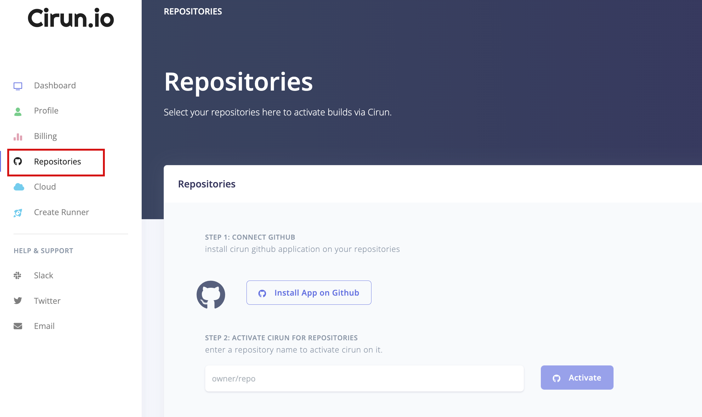
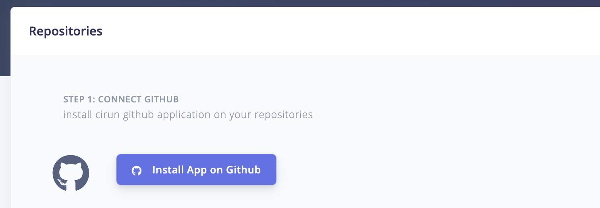
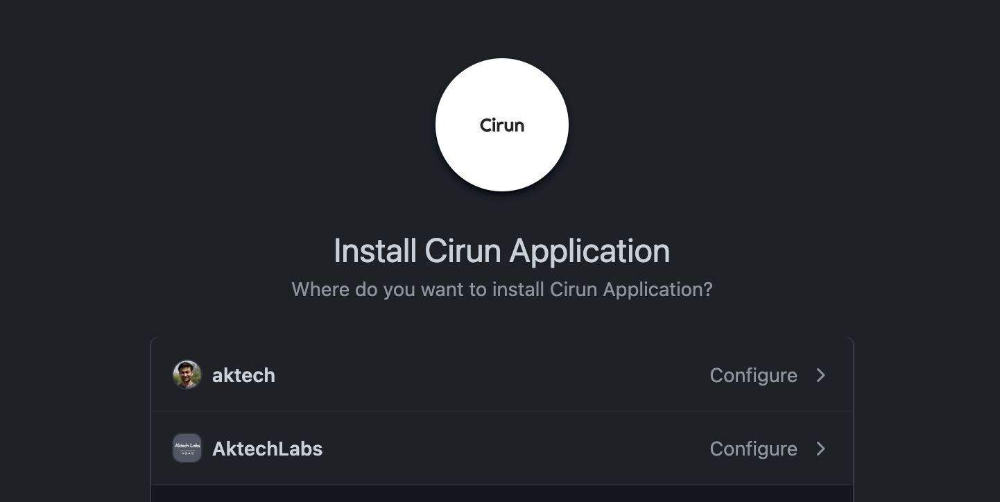
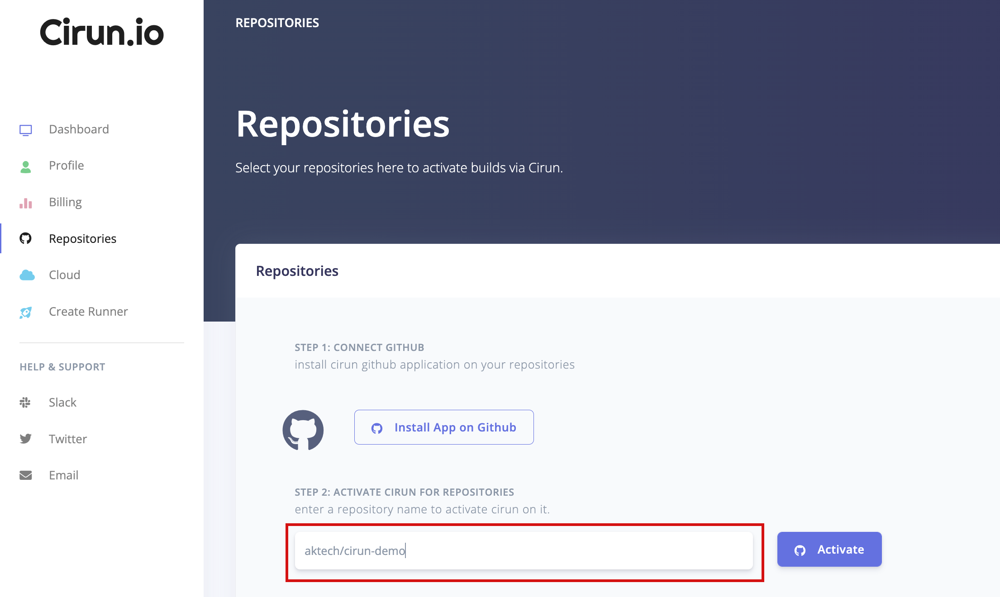
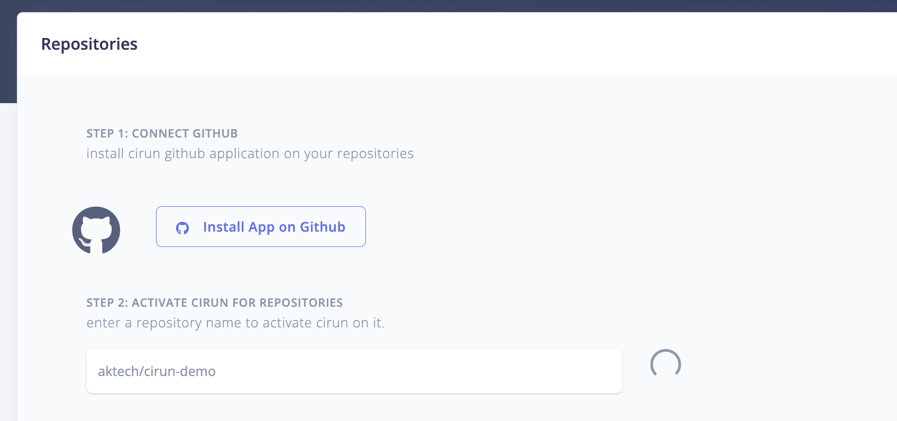
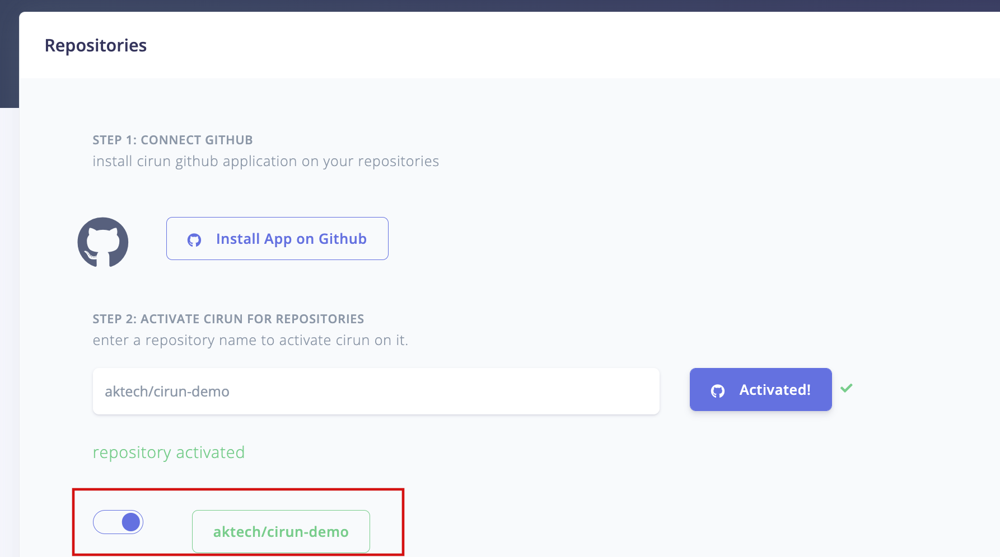

# Quickstart

Get Started with Cirun by going to Cirun.io <https://cirun.io>

- Login to <https://cirun.io>
- Click on Repositories Section on the left.

  

- Install the GitHub Application on the repositories, you would like Cirun.

  

  

- Activate Cirun for the repositories where you would like to run Cirun by adding the repository name and clicking on Activate.

  
  
  

- Click on the Cloud section on the left and add credentials for the cloud you want to run GitHub Action runners on.

- Create a `.cirun.yml` (please note it's `.cirun.yml` NOT `cirun.yml`) in the repository, see Reference docs.

- Now push anything to the repository, your actions should be running on your Cloud.
