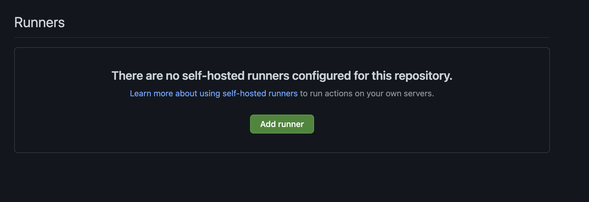

# Gotchas

## No Runner matching labels

:::danger
No runner matching the specified labels was found: self-hosted
:::

This is the most common gotcha a new user faces.

The most common reason for this is, either of the following:

- There are no runners configured for the repository or yet not configured.

- None of the configured runners matches the label from the workflow. Consider the
  following case, here the attached runner has labels: (`self-hosted, linux, x64, cirun.io, cpu, gcp, cirun-runner,`) and lets say the workflow you are trying to run
  requires a runner with label `self-hosted` and `gpu` and now clearly the runner
  below does not have `gpu` label, hence the workflow will fail immediately.

GitHub workflows fail immediately if there is no action runner available for your builds.
The first time you setup Cirun (first push to trigger cirun runner creation) there won't
be a runner attached to your repository.

:::note Solution
The solution to this is to try again (push again) after few minutes.
:::

Cirun creates the runner the first time you push to your repository with
the labels mentioned in the `.cirun.yml`, so that the next time the workflow
is triggered, GitHub is able to queue the workflow run, so that Cirun can
spin up a runner on the cloud for the GitHub Actions to run jobs on it.
This process takes a few minutes.
